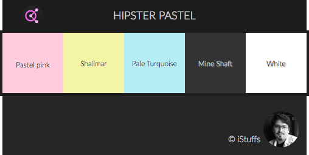

# Hipster Gradient

## Description

Le but était de produire un arrière plan moderne, dynamique et versatile dans un contexte d’utilisation de design de site internet.
 
J’ai mis en place une large entête avec un double arrière-plan, un gradient linéaire pastel et un svg.
Le svg est construit pour être répétable. Les icônes vectorielles (en svg) permettent une netteté quel que soit la taille de l’arrière plan à couvrir ou la définition (standard ou écran rétina 2x et 3x).
J'ai animé cet arrière-plan en CSS en lui faisant effectuer une translation horizontale.

## Thème
 
- Pastel pink: #FDCBDE
- Shalimar: #F4F4A6
- Pale Turquoise: #B4EDF3
- Mine Shaft: #333333
- White: #FFFFFF

Adobe color: [https://color.adobe.com/fr/Hipster-pastel-color-theme-6136123/](https://color.adobe.com/fr/Hipster-pastel-color-theme-6136123/)

## Police de caractère

La police utilisé est [Lato](http://www.latofonts.com/). Sans sérif, elle est moderne et lisible, idéale pour l’utilisation web.

## GitHub
 
**Repository**: [https://github.com/iStuffs/hipster-gradient](https://github.com/iStuffs/hipster-gradient)
**Démonstration**: [http://istuffs.github.io/hipster-gradient/](https://github.com/iStuffs/hipster-gradient)

--- 
© iStuffs